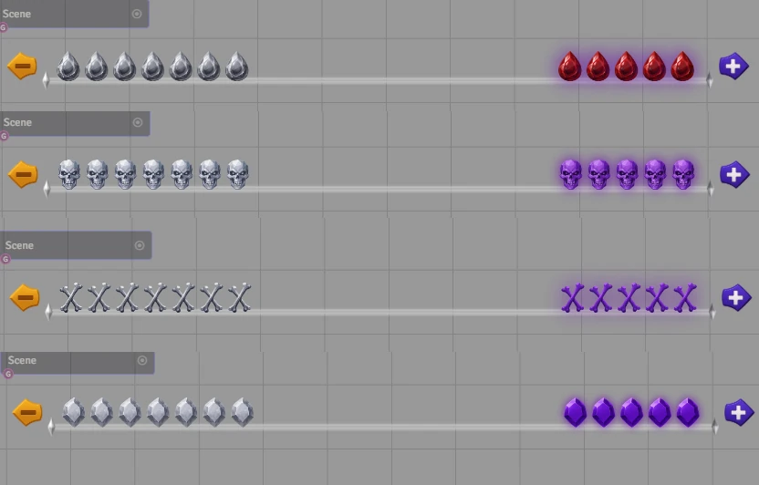
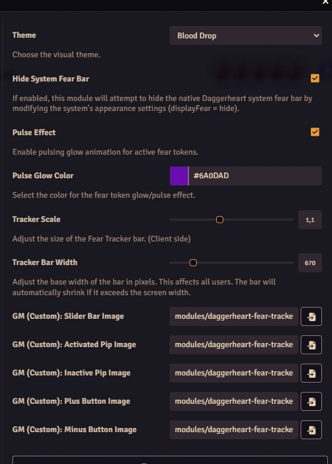

# Daggerheart: Fear Tracker

Adds a GM-controlled, animated slider bar for tracking Fear tokens in the Daggerheart system on Foundry VTT. This module is designed to integrate seamlessly with the game system, providing visual feedback for players and GMs alike.

<p align="center">
  
</p>

## Features

- **Automatic Sync:** The tracker automatically syncs with the Daggerheart system's Fear resource and Homebrew configuration (Max Fear tokens). Changes in the character sheet update the tracker, and changes in the tracker update the sheet.
- **Multiple Themes:** Choose from a variety of visual styles including Blood Drop, Bones, Capybara, Demon, Fire, Skull, Stone, and Stone Red.
- **Visual Effects:** Active fear tokens feature customizable pulsing (glow) and breathing (scale) animations.
- **Customizable:**
  - Adjust the visual scale and width of the tracker locally to fit your screen.
  - Choose the color of the pulse effect.
  - Enable/Disable specific animations.
  - Use your own custom images for the slider, pips, and buttons.
- **Drag & Drop:** Place the tracker anywhere on your screen. Positions are saved per user.
- **Visibility Control:**
  - **GM Control:** Toggle global visibility for all players using the eye icon.
  - **Local Hide:** Players can choose to hide the tracker locally via settings if they prefer (does not affect others).

## Configuration

You can access the module settings in the Foundry VTT "Configure Settings" menu under the "Module Settings" tab.

* **Theme:** Select the visual theme for the tracker.
* **Pulse Effect (Glow):** Enable or disable the glowing animation for active tokens.
* **Pulse Glow Color:** Choose the color of the glow effect.
* **Breathing Effect (Scale):** Enable or disable the growing/shrinking animation for active tokens.
* **Tracker Scale:** Adjust the size of the Fear Tracker bar locally.
* **Tracker Bar Width:** Adjust the width of the bar in pixels locally to fit your screen.
* **Custom Images:** If the "Custom" theme is selected, the GM can provide file paths for the Slider, Active Pip, Inactive Pip, Plus Button, and Minus Button.
* **Hide Fear Tracker (Local):** Hides the Fear Tracker module bar only for you. Does not affect the System bar or other players.

<p align="center">
  
</p>

## Macro: Reset Position

If you accidentally drag the Fear Tracker off-screen or lose it, don't worry! This module comes with a built-in Macro to reset its position.

1. Open the **Compendium Packs** tab in Foundry.
2. Look for the **"Fear Tracker - Macros"** compendium.
3. Drag the **"Reset Fear Tracker Position"** macro to your hotbar.
4. Click it to reset the tracker to the default position (100px, 100px).

Alternatively, you can create a new script macro with the following code:

```javascript
// Macro to reset the Daggerheart Fear Tracker position
// Useful if the bar has been moved off-screen or is lost.

const MODULE_ID = "daggerheart-fear-tracker";
const ELEMENT_ID = "fear-tracker-container";

// Default position to reset to (adjust if needed)
const defaultPosition = { top: "100px", left: "100px" };

try {
    // 1. Save the new position to client settings (persists after reload)
    await game.settings.set(MODULE_ID, "largeTrackerPosition", defaultPosition);

    // 2. Force immediate visual update by modifying the DOM directly
    // This ensures the player sees the bar move without needing to refresh (F5)
    const tracker = document.getElementById(ELEMENT_ID);
    if (tracker) {
        tracker.style.top = defaultPosition.top;
        tracker.style.left = defaultPosition.left;
    }

    // Notify the user
    ui.notifications.info("Daggerheart Fear Tracker: Position reset to default (100px, 100px).");

} catch (error) {
    console.error("Fear Tracker Reset Error:", error);
    ui.notifications.warn("Daggerheart Fear Tracker: Could not reset position. Make sure the module is active.");
}
```

## Manual Installation

To install this module manually, use the following manifest URL in the "Install Module" dialog within Foundry VTT:

`https://raw.githubusercontent.com/brunocalado/daggerheart-fear-tracker/main/module.json`

## 📜 Changelog

You can read the full history of changes in the [CHANGELOG](CHANGELOG.md).

---

## ⚖️ Credits and License
This is a Fork from: [Fear Tracker for Foundry](https://github.com/andrewbrick/Fear-Tracker-for-Foundry)

**Disclaimer:** This module is an independent creation and is not affiliated with Darrington Press.
