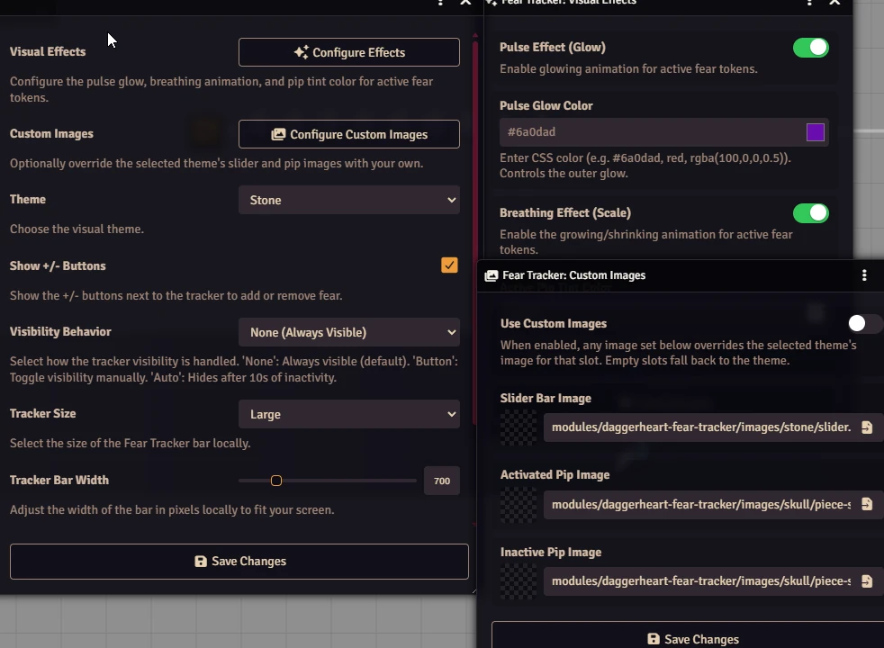

# Daggerheart: Fear Tracker

Adds a GM-controlled, animated slider bar for tracking Fear tokens in the Daggerheart system on Foundry VTT. This module is designed to integrate seamlessly with the game system, providing visual feedback for players and GMs alike.

<video src="https://github.com/user-attachments/assets/8adcbf9a-2e8b-4f2c-a36f-bafd2f457316" 
       controls 
       width="720"
       autoplay 
       loop 
       muted></video>


[](https://buymeacoffee.com/mestredigital) [](https://mestredigital.online/pages/projetos-en)

## Features

- **Automatic Sync:** The tracker automatically syncs with the Daggerheart system's Fear resource. Changes in the character sheet update the tracker, and changes in the tracker update the sheet.
- **Visual Effects:**
  - **Glow & Breath:** Active fear tokens pulse and breathe to draw attention.
  - **Tremor:** The bar shakes briefly when Fear increases, adding impact to the moment.
- **Customizable:**
  - **Themes:** Choose from various styles like **Nuclear**, **Ghost**, Skull, Blood Drop, Stone, and more.
  - **Button Styles:** Select specific designs for control buttons (Standard, Round, Squared) or match the main theme.
  - **Size & Width:** Easily switch between **Small**, **Normal**, and **Large** sizes and adjust the width to fit your screen.
  - **Tinting:** Apply color tints to active pips to match specific aesthetics using blend modes.
- **Drag & Drop:** Place the tracker anywhere on your screen. Positions are saved per user.
- **Visibility Modes:** Choose how the tracker is displayed: always visible, manually toggled via a button, or automatically hidden after inactivity.

## Configuration

Go to the **"Configure Settings"** menu in Foundry VTT -> **"Module Settings"** tab.

* **Theme:** Choose how the tracker looks. Includes **Nuclear**, **Ghost**, **Stone**, and more.
* **Buttons Theme:** Choose a specific style for the +/- buttons (e.g., Round, Squared) or use Custom images defined by the GM.
* **Visibility Behavior:** Select the visibility logic:
  * **None:** Always visible.
  * **Toggle Button:** Shows an eye icon to manually toggle visibility.
  * **Auto-Hide:** Automatically reduces visibility after 10 seconds of inactivity.
* **Tracker Size:** Select **Small**, **Normal**, or **Large**. (Recommended: Normal).
* **Tracker Bar Width:** Adjust the width in pixels.
* **Visual Effects:** Click **"Configure Effects"** to open a dedicated menu for:
  * **Pulse/Breathing Effects:** Enable or disable animations.
  * **Pulse Glow Color:** Pick a custom color for the glowing effect (outer glow).
  * **Active Pip Tint Color:** Apply a color tint to the active tokens (e.g., `red`, `#00ff00`). Uses multiply blending to dye the texture naturally.
* **Custom Images:** If using the "Custom" theme, you can upload your own images here.
* **Hide System Bar:** Automatically sets the Daggerheart system's Fear bar setting to 'hide' to avoid visual clutter and duplication.

<p align="center">
  
</p>

## Macro: Reset Position

If you lost the tracker off-screen or want to center it perfectly at the top of your window, you don't need a complex script anymore.

Simply create a new Script Macro with this single command:

```javascript
// Resets the tracker to the top-center of your screen
FearTracker.Reset();
```

You can also specify coordinates if you prefer a specific spot (X, Y):

```javascript
// Moves tracker to 100px from left and 100px from top
FearTracker.Reset(100, 100);
```

## Manual Installation

1. Copy this link: `https://raw.githubusercontent.com/brunocalado/daggerheart-fear-tracker/main/module.json`
2. Open Foundry VTT.
3. Go to the **"Add-on Modules"** tab and click **"Install Module"**.
4. Paste the link into the **"Manifest URL"** box and click Install.

## 📜 Changelog

You can read the full history of changes in the [CHANGELOG](CHANGELOG.md).

---

## ⚖️ Credits and License

* **Code License:** GNU GPLv3.

* This is a Fork from: [Fear Tracker for Foundry](https://github.com/andrewbrick/Fear-Tracker-for-Foundry)

* **Disclaimer:** This module is an independent creation and is not affiliated with Darrington Press.

# 🧰 My Daggerheart Modules

| Module | Description |
| :--- | :--- |
| 💀 [**Adversary Manager**](https://github.com/brunocalado/daggerheart-advmanager) | Scale adversaries instantly and build balanced encounters. |
| 🖼️ [**Art Mapper**](https://github.com/brunocalado/dh-assets) | Automatically assigns artwork to system compendiums, actors, tokens, and custom module content — keeping your visuals organized and up to date. |
| 🐉 [**Colossus**](https://github.com/brunocalado/dh-colossus) | Manage massive multi-part boss encounters with independent HP per part and a single shared stress pool. |
| 📦 [**Containers**](https://github.com/brunocalado/dh-containers) | Group inventory items into collapsible containers — pouches, chests, backpacks — to declutter character sheets. |
| 💥 [**Critical**](https://github.com/brunocalado/daggerheart-critical) | Animated criticals. |
| 💠 [**Custom Stat Tracker**](https://github.com/brunocalado/dh-new-stat-tracker) | Add custom trackers to actors. |
| ☠️ [**Death Moves**](https://github.com/brunocalado/daggerheart-death-moves) | Enhances the Death Move moment with a dramatic interface and full automation. |
| 📏 [**Distances**](https://github.com/brunocalado/daggerheart-distances) | Visualizes combat ranges with customizable rings and hover calculations. |
| 📦 [**Extra Content**](https://github.com/brunocalado/daggerheart-extra-content) | Homebrew content pack. |
| 😱 [**Fear Tracker**](https://github.com/brunocalado/daggerheart-fear-tracker) | Adds an animated slider bar with configurable fear tokens to the UI. |
| 🧟 [**Horde**](https://github.com/brunocalado/dh-horde) | Explode single horde tokens into dozens of individual tokens and manage their movement and stats automatically. |
| 🎁 [**Mystery Box**](https://github.com/brunocalado/dh-mystery-box) | Introduces mystery box mechanics for random loot and surprises. |
| ⚡ [**Quick Actions**](https://github.com/brunocalado/daggerheart-quickactions) | Quick access to common mechanics like Falling Damage, Downtime, etc. |
| 📜 [**Quick Rules**](https://github.com/brunocalado/daggerheart-quickrules) | Fast and accessible reference guide for the core rules. |
| 🤖 [**Resource Macros**](https://github.com/brunocalado/daggerheart-fear-macros) | Automatically executes macros when the Fear, Hope, Stress, HP, or Armor resources change. |
| 🎲 [**Stats**](https://github.com/brunocalado/daggerheart-stats) | Tracks dice rolls from GM and Players. |
| 🧠 [**Stats Toolbox**](https://github.com/brunocalado/dh-statblock-importer) | Import actors using a statblock. |
| 🛒 [**Store**](https://github.com/brunocalado/daggerheart-store) | A dynamic, interactive, and fully configurable in-game store. |
| 🔍 [**Unidentified**](https://github.com/brunocalado/dh-unidentified) | Obfuscates item names and descriptions until they are identified by the players. |
| 🌌 [**Void**](https://github.com/brunocalado/the-void-unofficial) | Unofficial module that brings The Void playtesting content — experimental classes, subclasses, ancestries, communities, adversaries, loot, weapons, and more. |

# 🗺️ Adventures

| Adventure | Description |
| :--- | :--- |
| ✨ [**I Wish**](https://github.com/brunocalado/i-wish-daggerheart-adventure) | A wealthy merchant is cursed; one final expedition may be the only hope. |
| 💣 [**Suicide Squad**](https://github.com/brunocalado/suicide-squad-daggerheart-adventure) | Criminals forced to serve a ruthless master in a land on the brink of war. |